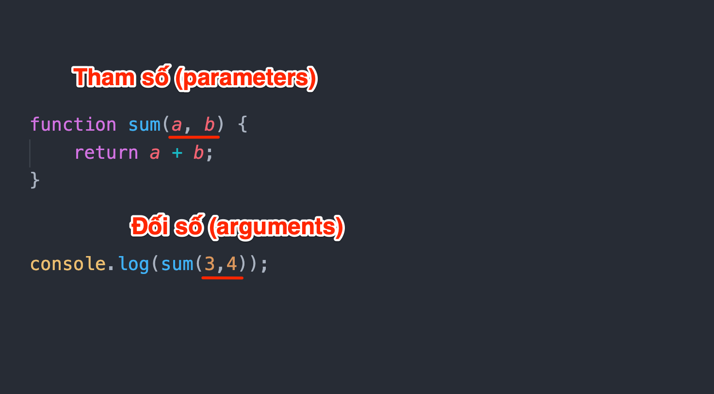

# Buổi 10: Function + Câu lệnh điều kiện

***

## **Function**

**Function là gì ?**

*Function (hàm) là tập hợp các đoạn code dùng để thực hiện một tác vụ cụ thể nào đó.*

Cú pháp định nghĩa function

```javascript
function functionName(para_1, ..., para_n) {
 // code thực thi function
}
```

Thực thi function

```javascript
functionName(para_1, ..., para_n)
```

**Phân biệt tham số (parameter) và đối số (argument)**

- **Tham số (parameter)** là biến trong khai báo hàm.
- **Đối số (argument)** là giá trị thực của biến này được truyền vào hàm.

Link tham khảo : [https://stackoverflow.com/questions/156767/whats-the-difference-between-an-argument-and-a-parameter](https://stackoverflow.com/questions/156767/whats-the-difference-between-an-argument-and-a-parameter)



***

## **Các loại function thường gặp**

**Một số loại function**

Function có các loại sau:
- Function có tham số, hoặc không có tham số
- Function có giá trị trả về hoặc không

**1. Function không có tham số**

```javascript
function sayHello() {
    console.log("Xin chào các bạn");
}

sayHello();
```

**2. Function có tham số**

Với function kiểu này có thể có một hoặc nhiều tham số (không nên quá 3 tham số)

```javascript
// Ví dụ function có 1 tham số
function sayHello(name) {
    console.log(`Xin chào ${name}`);
}
sayHello("Bùi Hiên");

// Ví dụ function có 2 tham số
function sayHello_1(name, city) {
    console.log(`Tôi tên là ${name}, quê tôi ở ${city}`);
}
sayHello_1("Bùi Hiên", "Thái Bình");
```

**3. Function trả về kết quả**

Để trả về kết quả, sử dụng từ khóa **`return`**

```javascript
function sum(a, b) {
    return a + b;
}

let data = sum(3, 4);
console.log(data);

// Nếu muốn kiểm tra nhanh kết quả của function có thể sử dụng luôn console.log
console.log(sum(4, 5));
```

>**Chú ý** : Những câu lệnh **đằng sau** từ khóa **return** sẽ **không** được thực thi

*Ví dụ:*

```javascript
function sum(a, b) {
    return a + b;
    console.log(a); // không được thực thi
    console.log(b); // không được thực thi
}
```

**4. Function không trả về kết quả**

Đối với function không có từ khóa **return** thì coi như function đó không trả về kết quả

***

## **Default Parameter ES6**

Cho phép khởi tạo function với những default value nếu như chúng được định nghĩa sai.

Khi sử dụng chức năng này sẽ giúp function dễ control và ít error hơn.

*Ví dụ:*

```javascript
function sayHello(name = "Thiên Cơ") {
    console.log(`Xin chào ${name}`);
}

sayHello(); // Thiên Cơ
sayHello("Cơ Nguyễn"); // Cơ Nguyễn
```

***

## **Phạm vi của biến (scope)**

*Scope có thể hiểu nôm na là “phạm vi sử dụng của biến”*

Có 3 loại scope:

- Global scope
- Function scope
- Block scope

**Global scope**

*Một biến được coi là global scope (toàn cục) nếu biến đó được định nghĩa bên ngoài function*

```javascript
//Global scope ( Biến toàn cục )
let number = 10;
let email = "kittloe1312@gmail.com";
```

**Function scope**

*Một biến được coi là function scope nếu biến đó được định nghĩa bên trong function*

```javascript
//Function scope ( Biến trong function )
function anSang(){
    let monAn = "Phở";
    console.log(monAn);
}
anSang();
```

**Block scope**

*Một biến được coi là block scope nếu biến đó được định nghĩa bên trong cặp dấu {}*

```javascript
// Block scope ( Biến trong {})
{
    let message = "Hôm nay trời đẹp quá";
    console.log(message);
    message1 = "Hôm nay trời quá đẹp"; // không khai báo bằng let/const sẽ trở thành biến global
}
console.log(message1);
```

**Chú ý**

> Nếu 1 biến không có từ khóa khai báo biến, sẽ trở thành biến **global**

```javascript
function sayHello() {
    number = 10;
    console.log(number);
}

sayHello() //10

console.log(number); //10
```

***

## **Kiểu dữ liệu Boolean**

**Kiểu dữ liệu Boolean**

_Giá trị của kiểu dữ liệu này chỉ có thể là **true** hoặc **false**_

*Ví dụ:*
```javascript
let a = true;
let b = false;
let c = !a;
let d = !b;
```

**Xác định giá trị Boolean**

Để xác định giá trị boolean cho biến, biểu thức,… ta sử dụng hàm **`Boolean()`**

*Ví dụ:*
```javascript
let a = 5;
console.log(Boolean(a));

let b = 6;
let c = 10;
console.log(Boolean(b < c));
```

**Truthy & Falsy value**

**Truthy value** là những giá trị mà khi ép kiểu về Boolean thì sẽ cho ra giá trị là **true**.

Ngược lại, **Falsy value** là những giá trị mà khi ép kiểu về Boolean thì cho ra giá trị là **false**.

**Note:**

- Có **6 giá trị** sau được coi là **falsy** : **false, 0, NaN, '', null, undefined**
- Các giá trị **còn lại**, ngoài các giá trị trên được gọi là **truthy**

## **Câu lệnh điều kiện if - else if - else**

**Câu lệnh if**

Thực hiện câu lệnh trong if nếu điều kiện cho trước là đúng.

```javascript
// Cú pháp
if (điều kiện) {
    // Code được thực thi nếu điều kiện đúng
} else {
    // Code được thực thi nếu điều kiện sai
}

// Câu lệnh if
let hour = 6;
if (hour < 12) {
  console.log("Good Morning");
}

let troiDep = true;
let coTien = false;
if (troiDep == true && coTien == true) {
  console.log("Đi chơi");
}
```

**Câu lệnh if - else**

Nếu **điều kiện đúng** thực hiện câu lệnh trong **if**, ngược lại nếu **điều kiện sai** thì hiện câu lệnh trong **else**.

```javascript
// Cú pháp
if (điều kiện) {
    // Code được thực thi nếu điều kiện đúng
} else {
    // Code được thực thi nếu điều kiện sai
}

// Ví dụ
let hour = 6;
if (hour < 12) {
    console.log("Good morning!");
} else {
    console.log("Good afternoon!");
}
```

**Câu lệnh if - else if - else**

Chỉ định một điều kiện mới nếu điều kiện đầu tiên là sai

```javascript
// Cú pháp
if (điều kiện 1) {
    // Code được thực thi nếu điều kiện 1 đúng
} else if (điều kiện 2) {
    // Code được thực thi nếu điều kiện 1 sai và điều kiện 2 đúng
} else {
    // Code được thực thi nếu điều kiện 1 và 2 sai
}

// Ví dụ
let hour = 6;
if (hour < 12) {
    console.log("Good morning!");
} else if (hour >= 12 && hour < 18) {
    console.log("Good afternoon!");
} else {
    console.log("Good evening!");
}
```

***

## **Phép so sánh**

**Toán tử so sánh**

```javascript
// Toán tử (&&)
console.log(true && true);      //true
console.log(true && false);     //false
console.log(false && true);     //false
console.log(false && false);    //false

// Toán tử (||)
console.log(true || true);      //true
console.log(true || false);     //true
console.log(false || true);     //true
console.log(false || false);    //false
```

**Sự khác biệt giữa == và ===**

`==` và `===` đều được sử dụng để so sánh

Tuy nhiên cần chú ý điểm sau khi sử dụng để thực hiện so sánh

- *Toán tử `==` so sánh trừu tượng (abstract equality), tức là nó thực hiện các chuyển đổi loại cần thiết trước khi so sánh (so sánh về mặt giá trị)*   

- *Còn toán tử `===` so sánh nghiêm ngặt (strict equality), nghĩa là nó sẽ không thực hiện chuyển đổi loại. Do đó nếu hai giá trị không cùng loại, thì khi so sánh, kết quả sẽ trả về false (so sánh về mặt giá trị và kiểu dữ liệu)*

*Ví dụ:*

```javascript
let a = 2;
let b = "2";

// Sử dụng toán tử ==
console.log(a == b) // true
// Đúng vì b khi thực hiện so sánh sẽ được convert sang dang số (2) 2 == 2 --> true

// Sử dụng toán tử ===
console.log(a === b) // false
// Sai vì kiểu dữ liệu của a là number và của b là string
```

***

## **Toán tử 3 ngôi**

Toán tử 3 ngôi trong JavaScript cho phép chúng ta kiểm tra một điều kiện nào đó trong một dòng code duy nhất và trả về giá trị, thay vì phải sử dụng nhiều câu lệnh if-else, giúp cho việc code đơn giản và thông minh hơn.

> *Lưu ý: Chỉ nên dùng khi ít điều kiện if-else để tránh rối mắt*

```javascript
// Cú pháp
condition ? true_value : false_value;
```

Trong đó:

- **condition** : Biểu thức điều kiện
- **true_value** : Được trả về nếu điều kiện đúng
- **false_value** : Được trả về nếu điều kiện sai

*Ví dụ:*

```javascript
// Sử dụng if-else bình thường
let hour = 6

if (hour < 12) {
    console.log("Good morning!");
} else {
    console.log("Good afternoon!");
}


// Sử dụng toán tử 3 ngôi
let hour = 6

hour < 12 ? console.log("Good morning!") : console.log("Good afternoon!")
```