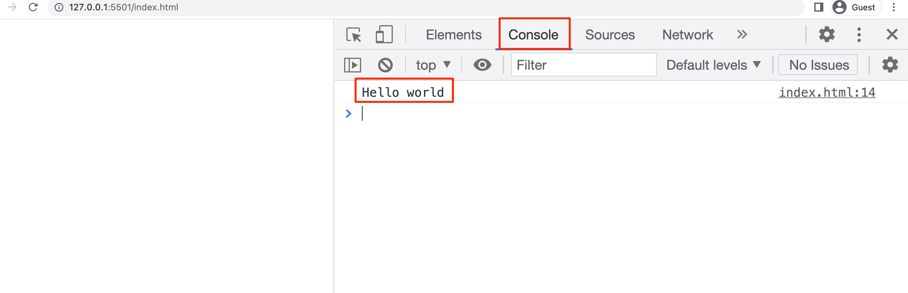
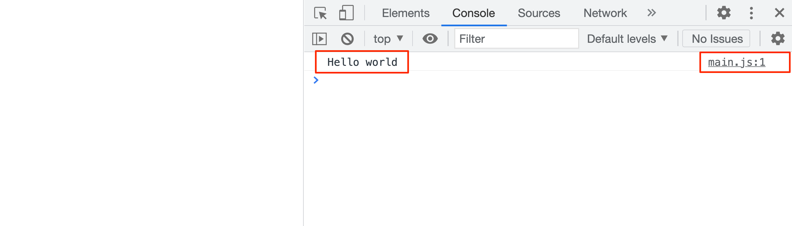

# Javascript Cơ Bản

## Giới thiệu về Javascript

**Javascript là gì?**

- *Javascript (JS) là một ngôn ngữ kịch bản phía client.*
- *Javascript được sử dụng rộng rãi trong việc kết hợp với HTML/CSS để thiết kế web động.*

**Javascript dùng để làm gì?**

- Sửa đổi nội dung của một trang web.
- Thay đổi style và vị trí của các thành phần trong trang web.
- Phản hồi với các sự kiện từ người dùng.
- Thực hiện và kiểm soát việc chuyển tiếp các hình ảnh động.
- Thông báo cho người dùng.
- Thao tác với dữ liệu đầu vào và hiển thị kết quả sau khi xử lý.
- ...

***

## Viết chương trình Javascript đầu tiên

#### Cách 1: Viết trực tiếp mã Javascript trong file HTML

- Tạo file **index.html**.
- Viết mã Javascript in ra dòng chữ "**Hello World**" trên màn hình console của trình duyệt.

```php
<!DOCTYPE html>
<html lang="en">
<head>
    <meta charset="UTF-8">
    <meta http-equiv="X-UA-Compatible" content="IE=edge">
    <meta name="viewport" content="width=device-width, initial-scale=1.0">
    <title>Document</title>
</head>
<body>
    
    <!-- Viết mã Javascript trong cặp thẻ script -->
    <script>
        console.log("Hello world");
    </script>
</body>
</html>
```

> Lưu ý : Mã javascript nên đặt ở phần cuối cùng của body

Mở file trên trình duyệt, sau đó **Bấm f12** hoặc **chuột phải + inspect** và vào tab **console** để xem kết quả



#### Cách 2 : Tạo file có đuôi là .js để viết mã Javascript (nên sử dụng)

- Tạo file **main.js** để viết mã Javascript (**main.js** nằm cùng cấp với **index.html**)
- Nhúng file **main.js** vào file **index.html** thông qua thuộc tính **src** trong thẻ **script**

```javascript
// file main.js
console.log("Hello world");
```

```php
<!DOCTYPE html>
<html lang="en">
<head>
    <meta charset="UTF-8">
    <meta http-equiv="X-UA-Compatible" content="IE=edge">
    <meta name="viewport" content="width=device-width, initial-scale=1.0">
    <title>Document</title>
</head>
<body>
    
    <!-- Link sang 1 file javascript -->
    <script src="./main.js"></script>
</body>
</html>
```

Quay lại trình duyệt và xem kết quả :



***

## Biến trong Javascript

#### Biến là gì?

*Biến là một định danh dùng để lưu trữ dữ liệu, thông qua biến chúng ta có thể thực hiện các thao tác với dữ liệu.*

*Mỗi biến có một kiểu dữ liệu riêng, dựa vào kiểu dữ liệu của biến có các thao tác khác nhau với biến.*

**Ví dụ:**
- Biến kiểu số thì có phép cộng, trừ, nhân, chia.
- Biến kiểu chuỗi thì có độ dài của chuỗi, phép nối 2 chuỗi, …

#### Khai báo biến 

Để khai báo biến sử dụng từ khóa : **`let / const`**

> Biến chưa được gán giá trị sẽ có kiểu giá trị là undefined.
> Biến const là biến cố định. => Một biến const chỉ được khai báo một lần.


Sử dụng 2 cách sau để khai báo biến:

- Khai báo biến và không gán giá trị cho biến: **let age;**
- Khai báo biến và gán giá trị cho biến: **let age = 35;**
```javascript
// Khai báo biến và không gán giá trị cho biến
let age;
age = 35;

// Khai báo biến và gán giá trị cho biến
let email = "kittloe1312@gmail.com"

// Khai báo biến const
const pi = 3.14;
```
> Lưu ý : Biến const bắt buộc phải khai báo và gán giá trị cho biến cùng lúc.

#### Quy tắc đặt tên biến

- Chứa các ký tự chữ, số, _ và $
- Ký tự đầu tiên không được là số (nên là chữ)
- Có phân biệt hoa thường
- Không trùng với các từ khóa của Javascript như: **for**, **while**, **this**, … [*link thảm khảo*](https://www.w3schools.com/js/js_reserved.asp)
- Nên đặt tên theo kiểu **camelCase** nếu tên biến có độ dài 2 từ trở lên cho dễ đọc. Ví dụ **binhphuong** thì nên đặt là **binhPhuong**.

#### Kiểm tra kiểu dữ liệu của biến

Để kiểm tra kiểu dữ kiệu của 1 biến, chúng ta sử dụng toán tử **`typeof`**

```javascript
let number = 23;
console.log(typeof number); // "number"

let name = "Cơ";
console.log(typeof name); // "string"
```

***

## Kiểu dữ liệu string
#### String là gì?
*String (chuỗi) là một đoạn text có thể có một hoặc nhiều ký tự.*

*Các chuỗi đều phải được bao quanh bằng cặp dấu nháy đơn ’ hoặc nháy kép ".*

**Ví dụ:** 

```javascript
let name = "Nguyễn Văn A";
let email = "abc@gmail.com";
```

#### Một số lưu ý
Trường hợp trong chuỗi cũng có xuất hiện dấu nháy đơn hoặc nháy kép thì phải thêm ký tự \ đằng trước dấu nháy đó.

```javascript
/*let message = "Xin chào các bạn, mình tên là \"Thiên Cơ\". Mình sinh năm 2003";*/
let message = 'Xin chào các bạn, mình tên là "Thiên Cơ". Mình sinh năm 2003';
```

Khi bạn muốn Enter xuống hàng một chuỗi thì bắt buộc phải sử dụng dấu + để nối chuỗi.

**Ví dụ:**

```javascript
let message = 'Xin chào các bạn, ' +
'mình tên là "Thiên Cơ". ' +
'Mình sinh năm 2003';
```

#### Nối chuỗi trong Javascript
Để nối chuỗi chúng ta sử dụng dấu + để ghép hai chuỗi (hoặc biến) lại với nhau.
```javscript
let firstName = "Nguyễn";
let lastName = "Thiên Cơ";
let fullName = firstName + " " + lastName;
console.log(fullName);                     //Nguyễn Thiên Cơ
```

**Ví dụ:**
```javascript
console.log(name + 10);                // "Cơ10"
console.log(10 + 20 + name + 10 + 20); // "30Cơ1020"
console.log(10+20-fullName);           // NaN : not a number
console.log("25"-"10");                // 25 - 10 = 15
console.log("25" / "10");
console.log("25" * "10");
//console.log("25" ** "10"); //lũy thừa 
```

***

## Template strings – ES6

Khai báo chuỗi sử dụng ký tự back-tick `` thay cho ký tự nháy đơn hoặc nháy kép.

Khi khai báo chuỗi kiểu này có thể viết chuỗi trong nhiều dòng và có thể dùng dấu nháy đơn hoặc nháy kép thoải mái mà không cần dùng escape character.

Có thể dùng các biến, biểu thức ngay trong chuỗi với cú pháp như sau: 

```javascript
`string_text ${expression} string_text`
```

**Ví dụ:**

```php
let year = 2003;
let message = `Xin chào các bạn,
mình tên là "${fullName}". Mình sinh năm ${year}. Năm nay mình ${2022 - year} tuổi.`;
console.log(message);
```
**Kết quả:**

```
Xin chào các bạn,
mình tên là "Nguyễn Thiên Cơ". Mình sinh năm 2003. Năm nay mình 19 tuổi.
```

***

## Kiểu dữ liệu Number & Math object trong Javascript

*Number (số) là một tập hợp của các con số (0 – 9) không chứa dấu khoảng trắng và có thể chứa dấu trừ (-) nằm ở đầu để đại diện cho số âm.*

**Ví dụ:**
```javascript
let age = 25;
let num = 5.1;
```

*Đối tượng **Math** trong Javascript sẽ giúp bạn thực hiện các biểu thức đặc biệt trong toán học.*

Một số phương thức hay được sử dụng :

- **Math.PI** : Lấy ra giá trị của số PI
- **Math.round(number)** : Làm tròn số bình thường
- **Math.ceil(number)** : Làm tròn số lên
- **Math.floor(number)** : Làm tròn số xuống
- **Math.random()** : Random 1 số ngẫu nhiên trong khoảng 0 -> 1
- **Math.min(number1, number 2, … number n)** : Lấy ra giá trị nhỏ nhất trong danh sách số
- **Math.max(number1, number 2, … number n)** : Lấy ra giá trị lớn nhất trong danh sách số
- **Math.pow(a, b)** : Số mũ (a^b)
- **Math.sqrt(number)** : Căn bậc 2
- …

**Ví dụ:**

```javascript
//Giá trị của PI
console.log(Math.PI);

//Làm tròn
console.log(Math.round(1.5));
console.log(Math.ceil(1.2));  //Làm tròn lên
console.log(Math.floor(1.7)); //Làm tròn xuống

//Lấy số ngẫu nhiên trong khoảng 0 -> 1
console.log(Math.random());

// Số mũ, căn
console.log(Math.pow(5,2));
console.log(Math.sqrt(4));

//Trị tuyệt đối
console.log(Math.abs(-6));

// Số lớn nhất, số nhỏ nhất
console.log(Math.min(1,2,3,4));
console.log(Math.max(1,2,3,4));
```

***

## Hướng dẫn viết Markdown

Link tham khảo : https://viblo.asia/helps/cach-su-dung-markdown-bxjvZYnwkJZ
